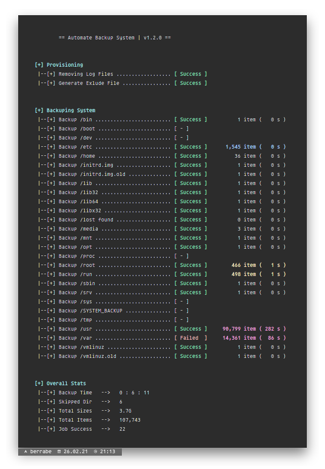
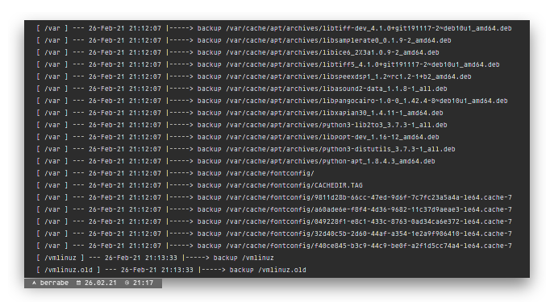

<p align="center">
  
</p>

<br/><br/>

### 1 - INTRO
---
when doing a linux system backup it sometimes takes a very long time, which usually takes a whole VM back up (if using virtualization).
That's why this script was created, which will only backup the important filesystem partitions and compress them into small files.

This script has been tested on CentOS, Debian and Arch Based System

<br/><br/>

### 2 - SETUP
---
the simple steps needed to use this script, all you have to do is download the script

```sh
> wget https://raw.githubusercontent.com/berrabe/automate-linux-backup/master/automate.sh
> chmod +x automate.sh
```

<br/>


<br/><br/>

### 3 - BACKUP
---
All you have to do is run a simple command. And the rest, the script will do it for you

```sh
> ./automate.sh backup

# view log files in realtime
> tail -f output.log
```
*By default, all backup files will be in the* `/SYSTEM_BACKUP` *folder in the form of compressed files*


<br/><br/>

### 4 - RESTORE
---
As well as the restore process, all you have to do is run a simple command. And the rest, the script will do it for you

```sh
> ./automate.sh restore

# view log files in realtime
> tail -f output.log
```
*By default, the script will restore from the files in the* `/SYSTEM_BACKUP` *folder*


<br/><br/>

### 5 - POC
---
<p align="center">
  <br/>
  <b>backup proses</b>
</p>

<p align="center">
  <br/>
  <b>backuplogs</b>
</p>

<br/><br/>

<p align="center">
  <br/>
  <b>restore proses</b>
</p>

<p align="center">
  
  <br/>
  <b>restore logs</b>
</p>
